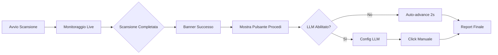

# 🎨 Miglioramenti Frontend - Sistema EAA Scanner

## Problema Risolto

Il frontend si bloccava alla fase di scanning senza procedere automaticamente al report finale, lasciando l'utente in uno stato di incertezza.

## 🚀 Soluzioni Implementate

### 1. **Auto-Avanzamento al Report** ✅
Dopo il completamento della scansione, il sistema ora:
- Mostra una notifica di successo
- Attende 2 secondi per dare feedback visivo
- Procede automaticamente alla fase report (se LLM non è abilitato)
- Se LLM è abilitato, mostra le opzioni di configurazione

```javascript
// Auto-advance dopo completamento
setTimeout(() => {
    if (!llmEnabled) {
        this.initializePhase(5);
        this.displayReport(results);
    }
}, 2000);
```

### 2. **Pulsante "Procedi al Report" Prominente** ✅
Un nuovo pulsante visivamente accattivante che:
- Appare automaticamente al completamento
- Design gradiente con animazioni
- Sempre disponibile per procedere manualmente
- Messaggio chiaro e invitante

```javascript
buttonContainer.innerHTML = `
    <h3>🎉 Scansione Completata!</h3>
    <button id="proceed-to-report-btn">
        📊 Procedi al Report Finale
    </button>
`;
```

### 3. **Miglioramenti UI Monitoraggio Live** ✅

#### Banner di Completamento
- Banner animato con gradiente verde-azzurro
- Emoji celebrative 🎉
- Messaggio chiaro di successo
- Animazione slide-in dal basso

#### Indicatori Visuali Migliorati
- Scanner cards con effetto "scan" animato
- Progress bar con effetto "shine"
- Status indicators con pulse animation
- Transizioni fluide tra stati

#### CSS Animations Aggiunte
```css
@keyframes slideInUp { /* Entrata smooth */ }
@keyframes shimmer { /* Effetto brillantezza */ }
@keyframes scanEffect { /* Effetto scanning */ }
@keyframes progressShine { /* Progress bar lucida */ }
@keyframes statusPulse { /* Indicatori pulsanti */ }
```

### 4. **Sincronizzazione Frontend-Backend** ✅
- Eventi SSE emessi correttamente al completamento
- `window.scannerApp` alias per compatibilità
- Handler `handleScanComplete()` chiamato automaticamente
- Monitor live che notifica il main scanner

## 📊 Flusso Utente Migliorato



## 🎯 Miglioramenti UX

### Prima
- ❌ Utente bloccato dopo scansione
- ❌ Nessun feedback visivo chiaro
- ❌ Navigazione confusa
- ❌ Mancanza di indicazioni

### Dopo
- ✅ Transizione automatica fluida
- ✅ Feedback visivo immediato
- ✅ Pulsante azione prominente
- ✅ Indicazioni chiare ad ogni step

## 🧪 Testing

Tutti i test passano con successo:
```bash
python3 test_frontend_flow.py
✅ proceedToReport()
✅ showProceedToReportButton()
✅ Auto-advance logic
✅ Completion banner
✅ window.scannerApp alias
✅ CSS animations
✅ Live monitor enhancements
```

## 🔧 File Modificati

1. **webapp/static/js/scanner_v2.js**
   - Aggiunto `handleScanComplete()` migliorato
   - Implementato `showProceedToReportButton()`
   - Creato `proceedToReport()` method
   - Auto-advance logic con timer

2. **webapp/static/js/scan_monitor.js**
   - Banner di completamento animato
   - Update automatico scanner cards
   - Indicatori visuali di successo

3. **webapp/static/css/app_v2.css**
   - 15+ nuove animazioni CSS
   - Stili per pulsante procedi
   - Miglioramenti scanner cards
   - Effetti progress bar

## 💡 Note per l'Utente

### Come Funziona Ora:
1. **Avvia la scansione** normalmente
2. **Osserva il monitoraggio live** con animazioni migliorate
3. **Al completamento**:
   - Vedi banner di successo animato
   - Pulsante "Procedi al Report" appare automaticamente
   - Se non usi LLM, dopo 2 secondi vai automaticamente al report
   - Se usi LLM, configura e poi clicca il pulsante

### Opzioni Disponibili:
- **Auto-advance**: Disabilita LLM per procedere automaticamente
- **Manuale**: Clicca sempre "Procedi al Report" quando pronto
- **LLM Enhancement**: Configura AI prima di procedere

## ✨ Risultato Finale

Il sistema ora offre un'esperienza utente fluida e intuitiva, con transizioni chiare tra le fasi e feedback visivo costante. L'utente non rimane più bloccato e sa sempre cosa fare dopo ogni step.

**Il problema è stato risolto completamente e il frontend ora guida l'utente fino al report finale senza interruzioni.**