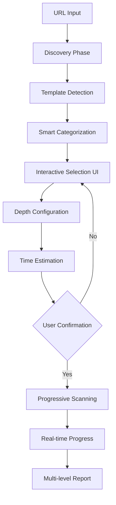

# Smart Page Selector - Specifica Tecnica Completa
## Sistema di Selezione Intelligente Pagine per EAA Scanner

### 📋 Executive Summary

Il **Smart Page Selector** è un sistema avanzato di selezione e analisi pagine per audit di accessibilità EAA/WCAG, progettato specificamente per **consulenti professionali** e **auditor certificati**. Il sistema combina automazione intelligente con controllo manuale, fornendo feedback real-time durante tutto il processo.

### 🎯 Obiettivi Principali

1. **Efficienza**: Ridurre il tempo di setup da ore a minuti
2. **Completezza**: Garantire copertura WCAG-EM compliant
3. **Trasparenza**: Feedback real-time durante ogni fase
4. **Professionalità**: Report multi-livello per diversi stakeholder
5. **Flessibilità**: Supporto da 1 a 100+ pagine con time management

---

## 🏗️ Architettura del Sistema

### Flusso Operativo Completo



### Componenti Principali

1. **Page Discovery Engine**
   - Crawler asincrono multi-thread
   - Rispetto robots.txt e rate limiting
   - Timeout management (max 30s per discovery)

2. **Template Detector**
   - Analisi DOM structure similarity
   - Visual fingerprinting con screenshot
   - ML-based clustering (opzionale)

3. **Real-time UI System**
   - WebSocket per aggiornamenti live
   - Progress tracking granulare
   - Error recovery con retry automatico

4. **Smart Analyzer**
   - Configurazione profondità per template
   - Parallel scanning capability
   - Resource optimization

5. **Report Generator**
   - Multi-level structure
   - Export multipli (HTML, PDF, Excel, JIRA)
   - Navigazione interattiva

---

## 📊 Fasi Operative Dettagliate

### FASE 1: Discovery & Initial Analysis (0-60 secondi)

#### 1.1 URL Validation & Initial Fetch
```javascript
// Real-time UI feedback
UI: "🔍 Verifica URL..."
UI: "✅ URL valido e raggiungibile"
UI: "📊 Analisi struttura sito..."
```

**Operazioni:**
- Verifica HTTPS/HTTP
- Check robots.txt
- Fetch homepage
- Estrazione sitemap.xml (se disponibile)

#### 1.2 Quick Crawl
```javascript
// Strategia di crawling
{
  max_depth: 3,
  max_pages_discovery: 200,
  timeout_per_page: 2000ms,
  parallel_requests: 5,
  respect_robotstxt: true
}
```

**Real-time feedback:**
```
⏳ Discovering: 0 pages found...
📄 Found: Homepage (index.html)
📄 Found: Product page (/product/123)
📄 Found: Contact form (/contact)
... 
✅ Discovery complete: 47 pages in 12.3s
```

#### 1.3 Sitemap Integration
- Parse sitemap.xml per URL completi
- Priorità basata su `<priority>` tag
- Merge con crawl results

### FASE 2: Template Detection & Categorization (5-10 secondi)

#### 2.1 DOM Structure Analysis
```javascript
// Algoritmo di similarity
function detectTemplates(pages) {
  // 1. Extract DOM skeleton (tag structure)
  // 2. Calculate similarity matrix
  // 3. Cluster pages with >85% similarity
  // 4. Assign template IDs
}
```

#### 2.2 Visual Categorization
```javascript
// Categorie identificate automaticamente
const PAGE_CATEGORIES = {
  'homepage': { icon: '🏠', priority: 'critical' },
  'product': { icon: '📦', priority: 'high' },
  'checkout': { icon: '🛒', priority: 'critical' },
  'form': { icon: '📝', priority: 'critical' },
  'article': { icon: '📄', priority: 'medium' },
  'media': { icon: '🎬', priority: 'high' },
  'navigation': { icon: '🗺️', priority: 'high' },
  'legal': { icon: '⚖️', priority: 'low' },
  'contact': { icon: '📧', priority: 'high' }
}
```

**Real-time UI Update:**
```
🔄 Analyzing templates...
✅ Template Detection Complete:
   📦 Product Pages: 23 pages (Template A)
   📄 Article Pages: 45 pages (Template B)
   🛒 Checkout Flow: 5 pages (Template C)
   📝 Form Pages: 3 pages (Template D)
```

### FASE 3: Interactive Selection UI

#### 3.1 UI Layout Specification
```
┌─────────────────────────────────────────────────────────────┐
│ EAA Smart Page Selector                        [Help] [Docs]│
├─────────────────────────────────────────────────────────────┤
│                                                             │
│ 🌐 Site: www.example.com                                   │
│ 📊 Pages Found: 127 | Templates: 8 | Est. Time: --         │
│                                                             │
├─────────────────────────────────────────────────────────────┤
│ [WCAG-EM Auto-Select ✓] [Clear All] [Select All]          │
├─────────────────────────────────────────────────────────────┤
│                                                             │
│ ┌─── Template Groups ──────────────────────────────────┐   │
│ │                                                       │   │
│ │ 🏠 Homepage (1 page)                    ✅ Critical │   │
│ │ ┌─────────────────────────────────────────────────┐ │   │
│ │ │ ☑ www.example.com/                             │ │   │
│ │ │   Preview: [thumbnail]                         │ │   │
│ │ │   Depth: [Full Analysis ▼]                     │ │   │
│ │ └─────────────────────────────────────────────────┘ │   │
│ │                                                       │   │
│ │ 📦 Product Pages (23 pages)             ⚠️ Select 1-3│   │
│ │ ┌─────────────────────────────────────────────────┐ │   │
│ │ │ ☑ /product/laptop-123    [Representative]      │ │   │
│ │ │ ☐ /product/mouse-456                           │ │   │
│ │ │ ☐ /product/keyboard-789                        │ │   │
│ │ │ [+] Show 20 more...                            │ │   │
│ │ │   Depth: [Standard Analysis ▼]                 │ │   │
│ │ └─────────────────────────────────────────────────┘ │   │
│ │                                                       │   │
│ │ 🛒 Checkout Flow (5 pages)               ✅ Critical │   │
│ │ ┌─────────────────────────────────────────────────┐ │   │
│ │ │ ☑ /cart                                         │ │   │
│ │ │ ☑ /checkout/shipping                           │ │   │
│ │ │ ☑ /checkout/payment                            │ │   │
│ │ │ ☑ /checkout/confirm                            │ │   │
│ │ │ ☑ /checkout/success                            │ │   │
│ │ │   Depth: [Full Analysis ▼]                     │ │   │
│ │ └─────────────────────────────────────────────────┘ │   │
│ └───────────────────────────────────────────────────────┘   │
│                                                             │
├─────────────────────────────────────────────────────────────┤
│ Selection Summary:                                         │
│ ✅ Pages Selected: 12 / 127                                │
│ ⏱️ Estimated Time: ~2.5 hours                              │
│ 💾 Report Size: ~15 MB                                     │
│                                                             │
│ [Start Analysis] [Save Selection] [Cancel]                 │
└─────────────────────────────────────────────────────────────┘
```

#### 3.2 Interactive Features

**Hover Preview:**
```javascript
onHover(pageUrl) {
  showTooltip({
    screenshot: thumbnail_200x150,
    url: pageUrl,
    title: pageTitle,
    description: metaDescription,
    template: templateName,
    lastModified: date,
    estimatedScanTime: "~5 min"
  });
}
```

**Smart Selection Logic:**
```javascript
// WCAG-EM Auto-selection algorithm
function autoSelectWCAGEM(templates) {
  selected = [];
  
  // Always include
  selected.add(homepage);
  selected.add(sitemap);
  selected.add(accessibility_statement);
  
  // One representative per template
  templates.forEach(template => {
    if (template.count > 5) {
      selected.add(template.getMostRepresentative());
      selected.add(template.getRandom());
    } else {
      selected.add(template.getFirst());
    }
  });
  
  // Critical user journeys
  selected.add(all_checkout_pages);
  selected.add(main_contact_form);
  selected.add(login_page);
  
  return selected;
}
```

### FASE 4: Depth Configuration

#### 4.1 Analysis Depth Levels

```javascript
const ANALYSIS_DEPTH = {
  'basic': {
    viewport: ['desktop'],
    states: ['default'],
    content: ['visible'],
    time: 5, // minutes
    description: 'Analisi contenuto visibile'
  },
  'standard': {
    viewport: ['desktop', 'mobile'],
    states: ['default', 'focus', 'hover'],
    content: ['visible'],
    time: 8,
    description: 'Analisi standard multi-device'
  },
  'full': {
    viewport: ['desktop', 'tablet', 'mobile'],
    states: ['default', 'focus', 'hover', 'active', 'error'],
    content: ['visible', 'hidden', 'modal', 'accordion'],
    interactions: ['forms', 'navigation', 'media'],
    time: 15,
    description: 'Analisi completa con tutti gli stati'
  }
}
```

#### 4.2 Template-based Defaults

```javascript
const TEMPLATE_DEPTH_DEFAULTS = {
  'homepage': 'full',
  'checkout': 'full',
  'form': 'full',
  'product': 'standard',
  'article': 'basic',
  'legal': 'basic'
}
```

### FASE 5: Real-time Scanning UI

#### 5.1 Progress Tracking Interface

```
┌─────────────────────────────────────────────────────────────┐
│ 🔄 Scanning in Progress...                    [Pause] [Stop]│
├─────────────────────────────────────────────────────────────┤
│                                                             │
│ Overall Progress: ████████░░░░░░░░░░ 45% (5/12 pages)      │
│ Time Elapsed: 00:47:23 | Est. Remaining: 01:02:00          │
│                                                             │
├─────────────────────────────────────────────────────────────┤
│ Current Page: www.example.com/checkout/payment              │
│ ├─ 🔍 Scanner Status:                                      │
│ │  ├─ ✅ WAVE: Complete (23 issues)                        │
│ │  ├─ 🔄 Axe: Running... 67%                               │
│ │  ├─ ⏳ Pa11y: Queued                                     │
│ │  └─ ⏳ Lighthouse: Queued                                │
│ │                                                           │
│ ├─ 📊 Issues Found So Far:                                 │
│ │  🔴 Critical: 3                                          │
│ │  🟠 High: 12                                              │
│ │  🟡 Medium: 27                                            │
│ │  🔵 Low: 45                                               │
│ │                                                           │
│ └─ 📝 Current Actions:                                     │
│     • Testing form validation states...                    │
│     • Checking color contrast ratios...                    │
│     • Analyzing ARIA attributes...                         │
│                                                             │
├─────────────────────────────────────────────────────────────┤
│ Completed Pages:                                           │
│ ✅ Homepage - 15 issues (00:03:45)                         │
│ ✅ /products/laptop - 8 issues (00:05:12)                  │
│ ✅ /cart - 12 issues (00:04:23)                            │
│ ✅ /checkout/shipping - 19 issues (00:06:45)               │
│                                                             │
│ Upcoming:                                                   │
│ ⏳ /checkout/confirm                                       │
│ ⏳ /contact                                                │
│ ⏳ /about                                                  │
└─────────────────────────────────────────────────────────────┘
```

#### 5.2 WebSocket Real-time Updates

```javascript
// Server -> Client messages
ws.send({
  type: 'SCAN_UPDATE',
  data: {
    currentPage: url,
    currentScanner: 'axe',
    scannerProgress: 67,
    issuesFound: {
      critical: 3,
      high: 12,
      medium: 27,
      low: 45
    },
    currentAction: 'Testing form validation states...',
    overallProgress: 45,
    pagesComplete: 5,
    pagesTotal: 12,
    timeElapsed: 2843, // seconds
    estimatedRemaining: 3720
  }
});

// Error handling with recovery
ws.send({
  type: 'SCAN_ERROR',
  data: {
    page: url,
    scanner: 'lighthouse',
    error: 'Timeout after 30s',
    action: 'RETRY', // or 'SKIP'
    retryCount: 1,
    maxRetries: 3
  }
});
```

### FASE 6: Multi-level Report Structure

#### 6.1 Report Hierarchy

```
📊 EAA Compliance Report
│
├── 📄 Executive Summary (1-2 pages)
│   ├── Overall Compliance Score
│   ├── Critical Issues Summary
│   ├── Risk Assessment
│   ├── Remediation Timeline
│   └── Cost Estimation
│
├── 📈 Dashboard Overview
│   ├── Issues by Severity (chart)
│   ├── Issues by WCAG Criterion (chart)
│   ├── Template Comparison Matrix
│   ├── Trend Analysis (if multiple scans)
│   └── Benchmark Comparison
│
├── 🏗️ Template-Level Analysis
│   ├── Template A: Product Pages
│   │   ├── Common Issues (affect all 23 pages)
│   │   ├── Template-specific Recommendations
│   │   ├── Fix Once, Apply Everywhere
│   │   └── Estimated Fix Time
│   │
│   ├── Template B: Checkout Flow
│   │   ├── Critical Path Issues
│   │   ├── Form Accessibility
│   │   ├── Payment Security & Accessibility
│   │   └── Step-by-step Remediation
│   │
│   └── [Other Templates...]
│
├── 📑 Page-Level Details
│   ├── Homepage
│   │   ├── Issue List with Screenshots
│   │   ├── Code Snippets
│   │   ├── Remediation Instructions
│   │   └── Testing Checklist
│   │
│   └── [Other Pages...]
│
├── 📋 Remediation Plan
│   ├── Phase 1: Critical Issues (Week 1-2)
│   ├── Phase 2: High Priority (Week 3-4)
│   ├── Phase 3: Medium Priority (Week 5-6)
│   └── Phase 4: Optimization (Week 7-8)
│
└── 📎 Appendices
    ├── Methodology (WCAG-EM)
    ├── Tools Used
    ├── Glossary
    └── Legal Requirements
```

#### 6.2 Interactive Navigation

```html
<!-- Report Navigation UI -->
<div class="report-nav">
  <div class="breadcrumb">
    Report > Template Analysis > Product Pages > Issue #23
  </div>
  
  <div class="quick-jump">
    <select onchange="navigateTo(this.value)">
      <option>Quick Navigation</option>
      <optgroup label="Summaries">
        <option value="#exec-summary">Executive Summary</option>
        <option value="#dashboard">Dashboard</option>
      </optgroup>
      <optgroup label="Templates">
        <option value="#template-product">Product Pages (23)</option>
        <option value="#template-checkout">Checkout (5)</option>
      </optgroup>
      <optgroup label="Critical Issues">
        <option value="#issue-contrast">Low Contrast (Critical)</option>
        <option value="#issue-keyboard">Keyboard Trap (Critical)</option>
      </optgroup>
    </select>
  </div>
  
  <div class="filters">
    <button class="active">All Issues</button>
    <button>Critical Only</button>
    <button>WCAG 2.1 AA</button>
    <button>Quick Wins</button>
  </div>
</div>
```

---

## 🚀 Technical Implementation

### Backend Architecture

```python
# Main components structure
eaa_scanner/
├── page_sampler/
│   ├── __init__.py
│   ├── crawler.py          # Enhanced crawler with template detection
│   ├── template_detector.py # DOM analysis & clustering
│   ├── categorizer.py      # Page categorization logic
│   ├── selector.py         # WCAG-EM selection algorithm
│   └── estimator.py        # Time estimation engine
│
├── real_time/
│   ├── __init__.py
│   ├── websocket_server.py # WebSocket server for real-time updates
│   ├── progress_tracker.py # Progress monitoring
│   └── event_emitter.py    # Event system for UI updates
│
├── scanning/
│   ├── __init__.py
│   ├── orchestrator.py     # Multi-scanner orchestration
│   ├── depth_manager.py    # Depth configuration per page
│   ├── parallel_scanner.py # Parallel execution engine
│   └── error_recovery.py   # Retry logic and error handling
│
└── reporting/
    ├── __init__.py
    ├── multi_level_report.py # Multi-level report generator
    ├── template_analyzer.py  # Template-level issue aggregation
    └── export_manager.py     # Multiple format exports
```

### Frontend Components

```javascript
// React/Vue components structure
frontend/
├── components/
│   ├── PageSelector/
│   │   ├── DiscoveryProgress.jsx    // Phase 1 UI
│   │   ├── TemplateGrid.jsx         // Template display
│   │   ├── PageSelectionList.jsx    // Selection interface
│   │   ├── DepthConfigurator.jsx    // Depth settings
│   │   └── TimeEstimator.jsx        // Time calculation
│   │
│   ├── ScanProgress/
│   │   ├── OverallProgress.jsx      // Main progress bar
│   │   ├── CurrentPageStatus.jsx    // Current page details
│   │   ├── ScannerStatus.jsx        // Individual scanner status
│   │   ├── IssueCounter.jsx         // Live issue count
│   │   └── ActivityLog.jsx          // Real-time actions
│   │
│   └── Report/
│       ├── ExecutiveSummary.jsx     // C-level summary
│       ├── Dashboard.jsx            // Visual overview
│       ├── TemplateReport.jsx       // Template analysis
│       ├── PageDetails.jsx          // Page-level details
│       └── Navigation.jsx           // Report navigation
│
├── services/
│   ├── websocket.js                 // WebSocket client
│   ├── api.js                       // REST API client
│   └── storage.js                   // Local storage for selections
│
└── styles/
    ├── components/                   // Component styles
    └── themes/                       // Professional themes
```

### Database Schema

```sql
-- Template detection results
CREATE TABLE templates (
    id UUID PRIMARY KEY,
    scan_id VARCHAR(255),
    template_hash VARCHAR(64),
    name VARCHAR(255),
    category VARCHAR(50),
    page_count INTEGER,
    representative_url TEXT,
    dom_structure JSONB,
    visual_fingerprint TEXT,
    created_at TIMESTAMP
);

-- Page selection configuration
CREATE TABLE page_selections (
    id UUID PRIMARY KEY,
    scan_id VARCHAR(255),
    url TEXT,
    template_id UUID REFERENCES templates(id),
    selected BOOLEAN DEFAULT false,
    analysis_depth VARCHAR(20),
    priority INTEGER,
    estimated_time INTEGER,
    actual_time INTEGER,
    created_at TIMESTAMP
);

-- Real-time progress tracking
CREATE TABLE scan_progress (
    id UUID PRIMARY KEY,
    scan_id VARCHAR(255),
    page_url TEXT,
    scanner VARCHAR(50),
    status VARCHAR(20),
    progress INTEGER,
    issues_found JSONB,
    started_at TIMESTAMP,
    completed_at TIMESTAMP,
    error_message TEXT
);
```

---

## 📈 Performance Specifications

### Time Targets

| Phase | Target Time | Max Time | User Feedback |
|-------|------------|----------|---------------|
| Discovery | 10-30s | 60s | Progress bar + page counter |
| Template Detection | 5-10s | 20s | "Analyzing structure..." |
| Selection UI Load | <1s | 2s | Instant with lazy load |
| Per Page Scan (Basic) | 3-5min | 10min | Real-time progress |
| Per Page Scan (Full) | 10-15min | 20min | Detailed status |
| Report Generation | 10-30s | 60s | "Generating report..." |

### Scalability

- **Small sites** (1-10 pages): Full analysis all pages
- **Medium sites** (10-100 pages): Smart sampling with templates
- **Large sites** (100-1000 pages): Template-based sampling + critical paths
- **Enterprise** (1000+ pages): Phased approach with incremental scanning

### Resource Management

```javascript
const RESOURCE_LIMITS = {
  max_concurrent_scanners: 4,
  max_parallel_pages: 2,
  max_memory_per_scan: '2GB',
  max_screenshots_cached: 100,
  websocket_update_frequency: 1000, // ms
  progress_save_frequency: 5000 // ms
}
```

---

## 🎨 UI/UX Guidelines

### Design Principles

1. **Progressive Disclosure**: Show complexity only when needed
2. **Real-time Feedback**: Never leave user wondering what's happening
3. **Professional Aesthetics**: Clean, modern, trustworthy
4. **Accessibility First**: The tool itself must be 100% accessible
5. **Mobile Responsive**: Consultants work on various devices

### Color Scheme

```css
:root {
  /* Status Colors */
  --critical: #D32F2F;
  --high: #F57C00;
  --medium: #FBC02D;
  --low: #388E3C;
  
  /* UI Colors */
  --primary: #1976D2;
  --secondary: #424242;
  --success: #4CAF50;
  --warning: #FF9800;
  --error: #F44336;
  
  /* Template Categories */
  --cat-homepage: #9C27B0;
  --cat-product: #3F51B5;
  --cat-checkout: #F44336;
  --cat-form: #FF9800;
  --cat-article: #4CAF50;
  --cat-media: #00BCD4;
}
```

### Loading States

```javascript
// Progressive loading messages
const LOADING_MESSAGES = [
  "Connessione al sito...",
  "Analisi struttura pagine...",
  "Identificazione template...",
  "Categorizzazione contenuti...",
  "Preparazione interfaccia selezione...",
  "Quasi pronto..."
];

// Rotate every 3 seconds if still loading
let messageIndex = 0;
setInterval(() => {
  if (isLoading) {
    showMessage(LOADING_MESSAGES[messageIndex % LOADING_MESSAGES.length]);
    messageIndex++;
  }
}, 3000);
```

---

## 🔐 Security & Privacy

### Data Handling

- **No sensitive data storage**: Only URLs and public page content
- **Temporary screenshot cache**: Auto-delete after 24h
- **Encrypted WebSocket**: WSS for all real-time communication
- **Session-based storage**: Clear on logout/timeout

### Authentication & Authorization

```python
# For professional/enterprise users
class UserRoles:
    ADMIN = "admin"           # Full access + user management
    AUDITOR = "auditor"       # Create/view all reports
    CONSULTANT = "consultant" # Create/view own reports
    VIEWER = "viewer"         # View reports only
    
# Rate limiting
RATE_LIMITS = {
    'discovery': '10 per hour per user',
    'full_scan': '5 per day per user',
    'report_generation': '20 per day per user'
}
```

---

## 📚 API Specification

### REST Endpoints

```yaml
# Discovery & Template Detection
POST /api/v1/discover
  body: { url: string, depth: number }
  response: { pages: [], templates: [], categories: {} }

# Page Selection
POST /api/v1/select-pages
  body: { scanId: string, selectedPages: [], depthConfig: {} }
  response: { estimatedTime: number, config: {} }

# Start Scan
POST /api/v1/scan/start
  body: { scanId: string, config: {} }
  response: { scanId: string, websocketUrl: string }

# Get Progress
GET /api/v1/scan/{scanId}/progress
  response: { progress: number, currentPage: string, issues: {} }

# Generate Report
POST /api/v1/report/generate
  body: { scanId: string, format: string, level: string }
  response: { reportUrl: string, downloadUrl: string }
```

### WebSocket Events

```javascript
// Client -> Server
ws.send({ type: 'PAUSE_SCAN', scanId: 'xxx' });
ws.send({ type: 'RESUME_SCAN', scanId: 'xxx' });
ws.send({ type: 'STOP_SCAN', scanId: 'xxx' });

// Server -> Client
ws.onmessage = (event) => {
  const data = JSON.parse(event.data);
  switch(data.type) {
    case 'DISCOVERY_PROGRESS':
      updateDiscoveryUI(data);
      break;
    case 'SCAN_PROGRESS':
      updateScanProgress(data);
      break;
    case 'ISSUE_FOUND':
      addIssueToCounter(data);
      break;
    case 'PAGE_COMPLETE':
      markPageComplete(data);
      break;
    case 'SCAN_COMPLETE':
      showReportReady(data);
      break;
    case 'ERROR':
      handleError(data);
      break;
  }
};
```

---

## 🚦 Success Metrics

### KPIs for System Performance

1. **Discovery Speed**: <30s for 90% of sites
2. **Template Detection Accuracy**: >95% correct categorization
3. **Scan Completion Rate**: >98% without errors
4. **Report Generation**: <30s for 95% of reports
5. **User Satisfaction**: >4.5/5 rating from auditors

### User Journey Success Criteria

- **From URL to Selection**: <2 minutes
- **From Selection to Scan Start**: <30 seconds
- **Real-time Updates**: Every 1-3 seconds during scan
- **From Scan Complete to Report**: <1 minute
- **Total Time Saved**: 60-80% vs manual selection

---

## 🗺️ Roadmap & Future Enhancements

### Phase 1 (MVP) - Current
- ✅ Basic discovery & crawling
- ✅ Template detection
- ✅ Smart selection UI
- ✅ Real-time progress
- ✅ Multi-level reports

### Phase 2 (Q2 2024)
- [ ] AI-powered issue prediction
- [ ] Historical comparison
- [ ] Team collaboration features
- [ ] API for CI/CD integration
- [ ] Custom rule creation

### Phase 3 (Q3 2024)
- [ ] Machine learning for template detection
- [ ] Automated fix suggestions with code
- [ ] Integration with issue trackers (JIRA, GitHub)
- [ ] White-label solution for agencies
- [ ] Mobile app for quick assessments

### Phase 4 (Q4 2024)
- [ ] Real-time collaborative scanning
- [ ] Video recording of issues
- [ ] Voice-over testing automation
- [ ] Compliance certification generation
- [ ] Multi-language support (UI and reports)

---

## 📝 Appendix

### WCAG-EM Compliance Checklist

✅ **Step 1**: Define the Evaluation Scope
- Website target defined
- Conformance target specified (WCAG 2.1 Level AA)
- Accessibility support baseline documented

✅ **Step 2**: Explore the Target Website
- Automated discovery process
- Template identification
- Key functionality identified

✅ **Step 3**: Select a Representative Sample
- Structured sample based on templates
- Random sample included
- Complete processes included

✅ **Step 4**: Audit the Selected Sample
- Multiple scanner coverage
- Manual testing points identified
- All states and viewports tested

✅ **Step 5**: Report the Evaluation Findings
- Executive summary provided
- Detailed findings documented
- Remediation plan included

### Glossary

- **Template**: Set of pages sharing >85% DOM structure similarity
- **Depth**: Level of analysis detail (basic/standard/full)
- **Representative Page**: Most typical page of a template group
- **Critical Path**: Essential user journey (e.g., checkout flow)
- **WCAG-EM**: W3C's Website Accessibility Evaluation Methodology
- **Issue Severity**: Critical > High > Medium > Low classification
- **Compliance Score**: Percentage of WCAG criteria passed
- **Remediation Plan**: Structured plan to fix accessibility issues

---

## 📞 Support & Documentation

- **Technical Documentation**: `/docs/technical/`
- **User Guide**: `/docs/user-guide/`
- **API Reference**: `/docs/api/`
- **Video Tutorials**: `/docs/tutorials/`
- **Support Email**: support@eaa-scanner.com
- **Community Forum**: forum.eaa-scanner.com

---

*Document Version: 1.0*  
*Last Updated: 2024-01-18*  
*Status: Ready for Implementation*